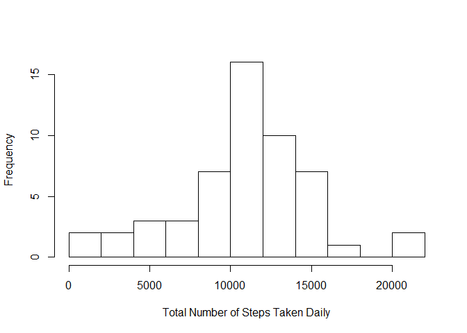
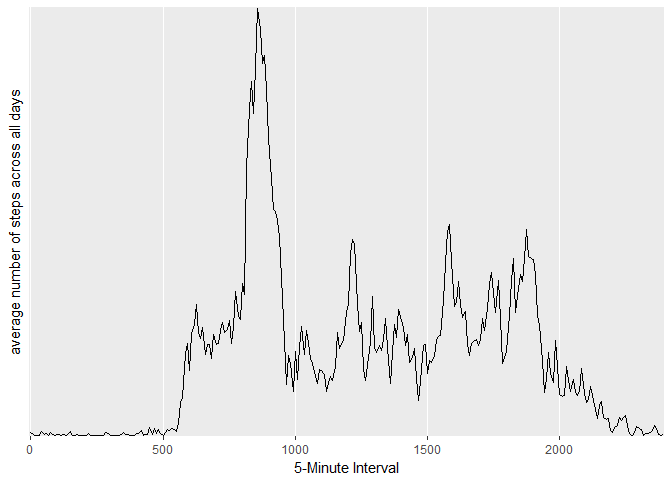
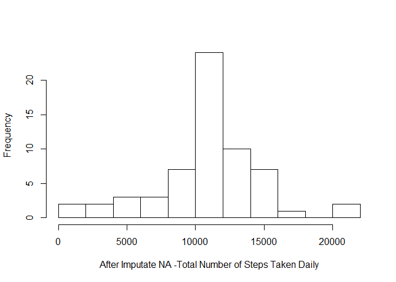
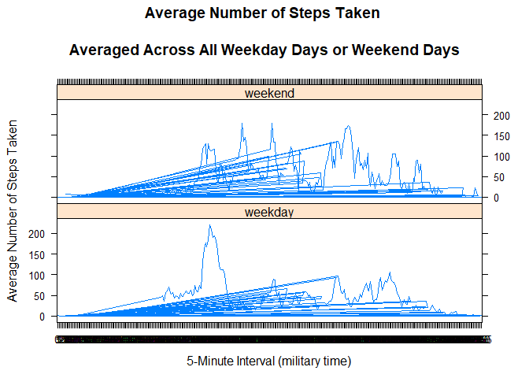

## Loading and preprocessing the data

This document presents the results of peer assessments 1 of course Reproducible Research on coursera. This assignment makes use of data from a personal activity monitoring device. This device collects data at 5 minute intervals through out the day. The data consists of two months of data from an anonymous individual collected during the months of October and November, 2012 and include the number of steps taken in 5 minute intervals each day.

This document presents the results of the Reproducible Research's Peer Assessment 1 in a report using a single R markdown document that can be processed by knitr and be transformed into an HTML file.

Through this report you can see that activities on weekdays mostly follow a work related routine, where we find some more intensity activity in little a free time that the employ can made some sport.

An important consideration is the fact of our data presents as a t-student distribution (see both histograms), it means that the impact of imputing missing values with the mean has a good impact on our predictions without a significant distortion in the distribution of the data. 

## Preparing Environment


Throughout this report when writing code chunks in the R markdown document, always use echo = TRUE so that someone else will be able to read the code.

First, we set echo equal a TRUE and results equal a 'hold' as global options for this document.


```r
library(knitr)
opts_chunk$set(echo = TRUE, results = 'hold')
```

After that we load the required libraries:


```r
library(data.table)
library(ggplot2) # we shall use ggplot2 for plotting figures
```


### Load source data and make the needed operations over it

We unzip the source files and read the CSV file with the data:


```r
unzip('activity.zip')
rdata <- read.csv('activity.csv', header = TRUE, sep = ",",
                  colClasses=c("numeric", "character", "numeric"))
rdata$date <- as.Date(rdata$date, format = "%Y-%m-%d")
rdata$interval <- as.factor(rdata$interval)
```
Now, let us check the data using str() method:


```r
str(rdata)
```

```
## 'data.frame':	17568 obs. of  3 variables:
##  $ steps   : num  NA NA NA NA NA NA NA NA NA NA ...
##  $ date    : Date, format: "2012-10-01" "2012-10-01" ...
##  $ interval: Factor w/ 288 levels "0","5","10","15",..: 1 2 3 4 5 6 7 8 9 10 ...
```


## What is mean total number of steps taken per day?


* Create a new dataset ignoring missing data NA
* Plot a histogram of the total number of steps taken each day
* Report the mean and median total number of steps taken per day


```r
data <- na.omit(rdata) 

# sum steps by date
daily.steps <- rowsum(data$steps, format(data$date, '%Y-%m-%d')) 
daily.steps <- data.frame(daily.steps) 
names(daily.steps) <- ("steps") 
mean_steps <- mean(daily.steps$steps)
median_steps <- median(daily.steps$steps)
```

Plot histogram of the total number of steps taken each day:


```r
hist(daily.steps$steps, 
     main=" ",
     breaks=10,
     xlab="Total Number of Steps Taken Daily")
```

<!-- -->

Report mean and median of steps:


```r
mean_steps
```

```
## [1] 10766.19
```


```r
median_steps
```

```
## [1] 10765
```


## What is the average daily activity pattern?


* Calculate average steps for each of 5-minute interval during a 24-hour period.
* Make a time series plot (i.e. type = "l") of the 5-minute interval (x-axis) and the average number of steps taken, averaged across all days (y-axis)
* Report which 5-minute interval, on average across all the days in the dataset, contains the maximum number of steps?
* Observer and comment the average daily activity pattern


```r
library(plyr)
# Calculate average steps for each of 5-minute interval during a 24-hour period
interval.mean.steps <- ddply(data,~interval, summarise, mean=mean(steps))
```

Plot time series of the 5-minute interval and the average number of steps taken, averaged across all days


```r
library(ggplot2)
ggplot(data =interval.mean.steps, aes(x=interval, y=mean, group =1)) +
geom_line() +
scale_x_discrete(name="5-Minute Interval", breaks=c(0,500,1000,1500,2000,2500)) +
scale_y_discrete(name= "average number of steps across all days")
```

<!-- -->

Report the 5-min interval, on average across all the days in the dataset, contains the maximum number of steps:


```r
interval.mean.steps[which.max(interval.mean.steps$mean), ]
```

```
##     interval     mean
## 104      835 206.1698
```


## Imputing missing values

Note that there are a number of days/intervals where there are missing values (coded as NA). The presence of missing days may introduce bias into some calculations or summaries of the data. In this section:

* Calculate and report the total number of missing values in the dataset (i.e. the total number of rows with NAs)
* Implement a strategy for filling in all of the missing values in the dataset. For this assignment the strategy is to use the mean for that 5-minute interval to replace missing valuse. Create a new dataset that is equal to the original dataset but with the missing data filled in.
* Make a histogram of the total number of steps taken each day
* Calculate and report the mean and median total number of steps taken per day.
* Make following comments: Do these values differ from the estimates from the first part of the assignment? What is the impact of imputing missing data on the estimates of the total daily number of steps?

Calculate and report the total number of missing values in the dataset (i.e. the total number of rows with NAs)


```r
library(sqldf)
```

```
## Loading required package: gsubfn
```

```
## Loading required package: proto
```

```
## Loading required package: RSQLite
```


```r
tNA <- sqldf(' 
    SELECT d.*            
    FROM "rdata" as d
    WHERE d.steps IS NULL 
    ORDER BY d.date, d.interval ') 
```


```r
NROW(tNA) 
```

```
## [1] 2304
```


Implement a strategy for filling in all of the missing values in the dataset. For this assignment the strategy is to use the mean for that 5-minute interval to replace missing valuse. Create a new dataset (t1) that is equal to the original dataset but with the missing data filled in. The dataset is ordered by date and interval. The following SQL statement combines the original "data" dataset set and the "interval.mean.steps" dataset that contains mean values of each 5-min interval ageraged across all days.


```r
t1 <- sqldf('  
    SELECT d.*, i.mean
    FROM "interval.mean.steps" as i
    JOIN "rdata" as d
    ON d.interval = i.interval 
    ORDER BY d.date, d.interval ') 

t1$steps[is.na(t1$steps)] <- t1$mean[is.na(t1$steps)]
```


In the following, prepare data for plot histogram calculate mean and median:


```r
t1.total.steps <- as.integer( sqldf(' 
    SELECT sum(steps)  
    FROM t1') );

t1.total.steps.by.date <- sqldf(' 
    SELECT date, sum(steps) as "t1_total_steps_by_date" 
    FROM t1 GROUP BY date 
    ORDER BY date') 

daily.61.steps <- sqldf('   
    SELECT date, t1_total_steps_by_date as "steps"
    FROM "t1.total.steps.by.date"
    ORDER BY date') 
```

Make a histogram of the total number of steps taken each day.

```r
hist(daily.61.steps$steps, 
     main=" ",
     breaks=10,
     xlab="After Imputate NA -Total Number of Steps Taken Daily")
```

<!-- -->

Calculate and report the mean and median total number of steps taken per day.


```r
t1.mean.steps.per.day <- as.integer(t1.total.steps / NROW(t1.total.steps.by.date) )
t1.mean.steps.per.day
```

```
## [1] 10766
```


```r
t1.median.steps.per.day <- median(t1.total.steps.by.date$t1.total.steps.by.date)
t1.median.steps.per.day
```

```
## NULL
```

Observations:

    Do these values (mean and median) differ from the estimates from the first part of the assignment? Not Really.

    What is the impact of imputing missing data on the estimates of the total daily number of steps? The shape of the histogram remains the same as the histogram from removed missing values. However, the frequency counts increased as expected. In this case, it seems that the data imputation strategy should work for the downstream data analysis and modeling.


## Are there differences in activity patterns between weekdays and weekends?

* Use the dataset with the filled-in missing values for this part. Create a new factor variable in the dataset with two levels - "weekday" and "weekend" indicating whether a given date is a weekday or weekend day.
* Make a panel plot containing a time series plot (i.e. type = "l") of the 5-minute interval (x-axis) and the average number of steps taken, averaged across all weekday days or weekend days (y-axis).

Create a factor variable weektime with two levels (weekday, weekend). The folowing dataset t5 dataset contains data: average number of steps taken averaged across all weekday days and weekend days, 5-min intervals, and a facter variable weektime with two levels (weekday, weekend).


```r
t1$weektime <- as.factor(ifelse(weekdays(t1$date) %in% 
                c("sabado","domingo"),"weekend", "weekday"))

t5 <- sqldf('   
    SELECT interval, avg(steps) as "mean.steps", weektime
    FROM t1
    GROUP BY weektime, interval
    ORDER BY interval ')
```
Make a panel plot containing a time series plot (i.e. type = "l") of the 5-minute interval (x-axis) and the average number of steps taken, averaged across all weekday days or weekend days (y-axis).


```r
library("lattice")
p <- xyplot(mean.steps ~ interval | factor(weektime), data=t5, 
       type = 'l',
       main="Average Number of Steps Taken 
       \nAveraged Across All Weekday Days or Weekend Days",
       xlab="5-Minute Interval (military time)",
       ylab="Average Number of Steps Taken",
       layout=c(1,2))
print (p)    
```

<!-- -->

Observations:

Are there differences in activity patterns between weekdays and weekends? Yes. The plot indicates that movement patterns differ from weekdays to weekends.

Conclusion

In this assignment, it provided a step-by-step approach for analyzing data. The data analysis started from loading data, transform data including the strategy and implementation of dealing with missing data, and reporting statistical data and plots. The reader should be able to follow the document and reproduce the same results

